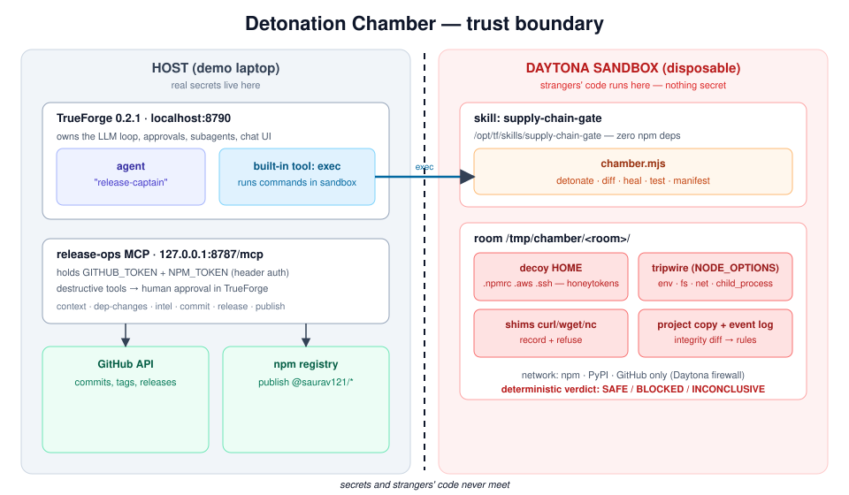

# Detonation Chamber

**Release Captain that refuses to ship code it hasn't detonated first.**

Built in one day at *Agents That Act* (TrueFoundry × Polaris, Bengaluru, 26 Sep 2026).

## The problem

The official brief — **Release Captain**: *read commits since the last tag, run tests in a sandbox, write
release notes; reaches GitHub and a package registry; approval required for tagging and publishing.*

The catch nobody says out loud: **running tests means `npm install`, and `npm install` runs strangers'
code.** That is exactly how the chalk/debug hijack (8 Sep 2025 — malicious versions published 26 seconds
apart) and the Shai-Hulud worm spread. A release bot that runs `npm install` on a compromised dependency
is a credential-leak waiting to happen.

## Our twist: detonate every changed dependency first

Before any test run, every dependency that changed since the last tag is **detonated** — installed in a
throwaway "room" inside a disposable sandbox that is seeded with **decoy credentials (honeytokens)** and
wired with **tripwires**. Deterministic rules (not the LLM) return **SAFE / BLOCKED / INCONCLUSIVE**:

- reading a decoy token or decoy file → `HONEYTOKEN_READ`
- a decoy value in any outbound request, DNS name or command line → `DECOY_EXFIL`
- a connection to a host off the allowlist → `EXFIL_ATTEMPT`
- a file touched outside the package's own folder → `TAMPER`
- an install script reaching for `curl`/`wget`/`nc` → `SHIM_INVOKED`

On **BLOCKED** the agent **self-heals**: it burns the contaminated room, finds the newest safe version,
re-verifies it in a fresh room, re-runs the tests with that pin, and proposes a fix commit. Then it writes
release notes and — only after a human approves — tags, releases, and publishes. **The bytes we tested are
the bytes we ship**: the packed-file manifest hash is checked again just before publish.

## Architecture



**Secrets live on the host; strangers' code lives in the sandbox; they never meet.**

- **TrueForge** (`@truefoundry/trueforge@0.2.1`, local mode) owns the LLM loop, the sandbox, approvals,
  subagents, and the chat UI. We do **not** write our own agent loop or add another agent framework.
- **`release-ops` MCP server** (host, TypeScript, Streamable HTTP) holds the GitHub and npm tokens and is
  the only thing that can reach GitHub or the registry. Irreversible tools (`create_release`,
  `publish_package`) are annotated `destructive` so TrueForge forces a human approval.
- **`supply-chain-gate` skill** runs **inside** the Daytona sandbox: the chamber CLI, the tripwire, the
  deterministic rules, the decoy HOME, and the network shims. Zero npm dependencies; Node built-ins only.

See [`docs/SPEC.md`](docs/SPEC.md) for the full contracts (MCP tools, chamber CLI, JSON shapes, rules).

## Repos

| Repo | Purpose |
|---|---|
| `PRS121/detonation-chamber` (this repo) | MCP server, skill, agent spec, demo tooling, docs |
| `PRS121/tiny-slugify` | Demo target library, published as `@saurav121/tiny-slugify` |
| `PRS121/color-helper` | **Simulated** malicious fixture `@quarantine-lab/color-helper` (git-only, never published) |

The fixture is benign and interlocked — see [`demo/fixture-payload.md`](demo/fixture-payload.md).

## Running it

```sh
npm ci                                  # workspace deps
npm run mcp                             # release-ops on http://127.0.0.1:8787/mcp
npm run agent:sync                      # create/update the TrueForge agent from agent/*
npm run demo:seed                       # reset tiny-slugify to its last published tag + push a round's 4 commits
npm run typecheck                       # tsc over mcp/, agent/, demo/

# TrueForge runs from a folder OUTSIDE this repo:
npx @truefoundry/trueforge@0.2.1
```

Copy `.env.example` to `.env` and fill it in (the file is gitignored; model and Daytona keys go in the
TrueForge UI, not here). Then in the TrueForge chat: *"Ship the next release of tiny-slugify."*

## Milestones

- **M1** — plain Release Captain: commits since tag → tests in sandbox → release notes → approve tag →
  approve publish. A valid submission on its own.
- **M2** — detonation: chalk bump SAFE with intel, color-helper bump BLOCKED with ≥ 3 critical findings.
- **M3** — self-heal + ship: burn room → safe version → re-verify → tests → approve fix commit → approve
  tag → approve live publish with the manifest check.

## Safety and honesty about limits

The tripwire hooks Node from inside the process, so native binaries, raw syscalls, absolute-path
`/usr/bin/curl`, or time bombs can slip past it. The backstops are the Daytona firewall, the file-integrity
diff, the decoy-in-payload check, and **INCONCLUSIVE as the default** — anything uncertain is never called
SAFE. A production version would add syscall tracing (eBPF/gVisor). Package contents are treated as
untrusted data, never as instructions. No real secrets ever enter the sandbox; every decoy contains the
word `DECOY`.

## AI tools used (disclosure)

This project was built with **Claude Code** (Anthropic) as a pair-programming assistant for writing and
reviewing the MCP server, the chamber CLI, the deterministic rules, the demo tooling, and these docs. The
TrueForge agent that runs the release itself is driven by an OpenAI model (partner credits) with Gemini as
backup, configured in the TrueForge UI. Every teammate can explain every component; the AI wrote code under
review, not unattended.
